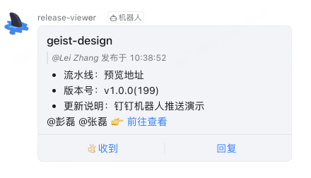
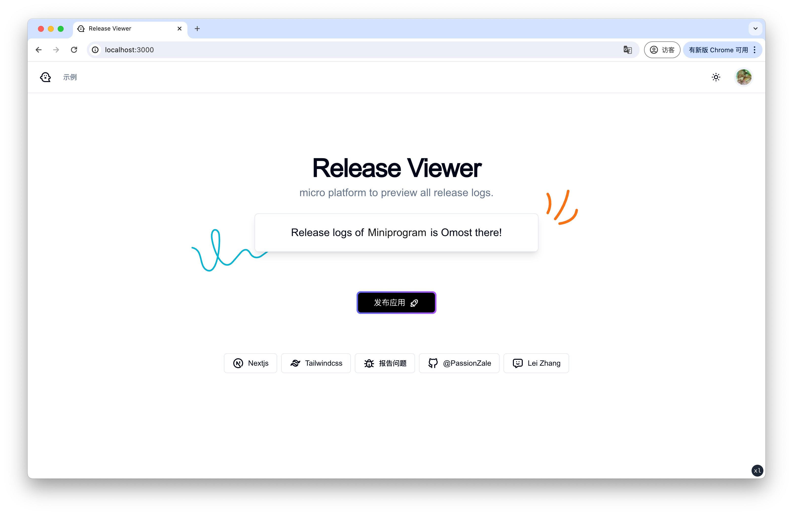
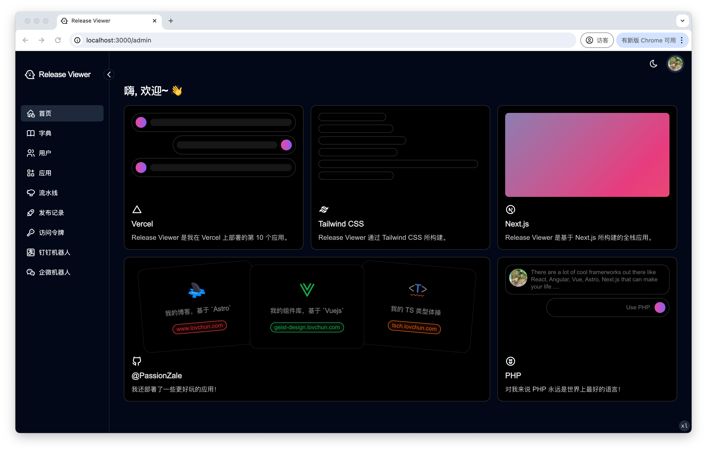

# Release Viewer

micro platform to preview all release logs.

## Screenshots

#### Robot Push

- 钉钉机器人（支持 markdown @手机号)



- 企微机器人（**仅支持** text @手机号)


#### Light



<details>
<summary>Click to see more...</summary>


</details>

#### Dark


<details>
<summary>Click to see more...</summary>





</details>

## Deps

#### Server

| repo                                             | remark                                  |
| ------------------------------------------------ | --------------------------------------- |
| [prisma](https://github.com/prisma/prisma)       | ORM                                     |
| [jose](https://github.com/panva/jose)            | JWT Sign, Verify, Parse                 |
| [bcryptjs](https://github.com/dcodeIO/bcrypt.js) | Password Hashed, Verify                 |
| [zod](https://github.com/colinhacks/zod)         | schema validation for API Request Input |

#### Clinet

| repo                                                          | remark                               |
| ------------------------------------------------------------- | ------------------------------------ |
| [shadcn-ui](https://github.com/shadcn-ui/ui)                  | UI Design                            |
| [next-themes](https://github.com/pacocoursey/next-themes)     | Theme                                |
| [zustand](https://github.com/pmndrs/zustand)                  | Gloabl State Manage                  |
| [qs](https://github.com/ljharb/qs)                            | format Get query params              |
| [@tabler/icons-react](https://github.com/tabler/tabler-icons) | Icons                                |
| [dayjs](https://github.com/iamkun/dayjs)                      | Datetime humanize                    |
| [zod](https://github.com/colinhacks/zod)                      | schema validation form Form onSubmit |

## Quick Start

```shell
git clone https://github.com/PassionZale/release-viewer.git

cd release-viewer/

cp .env.example .env

yarn

yarn prisma:setup

yarn dev
```
